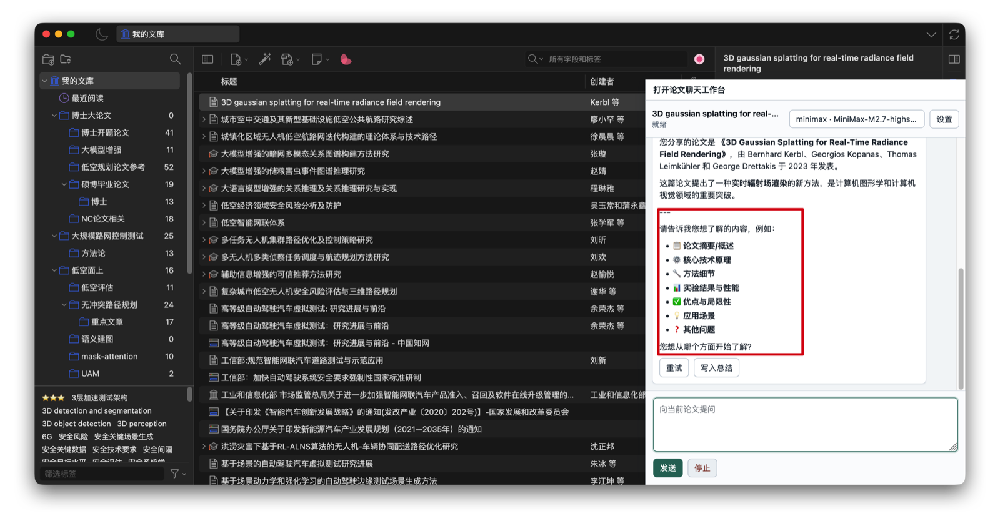
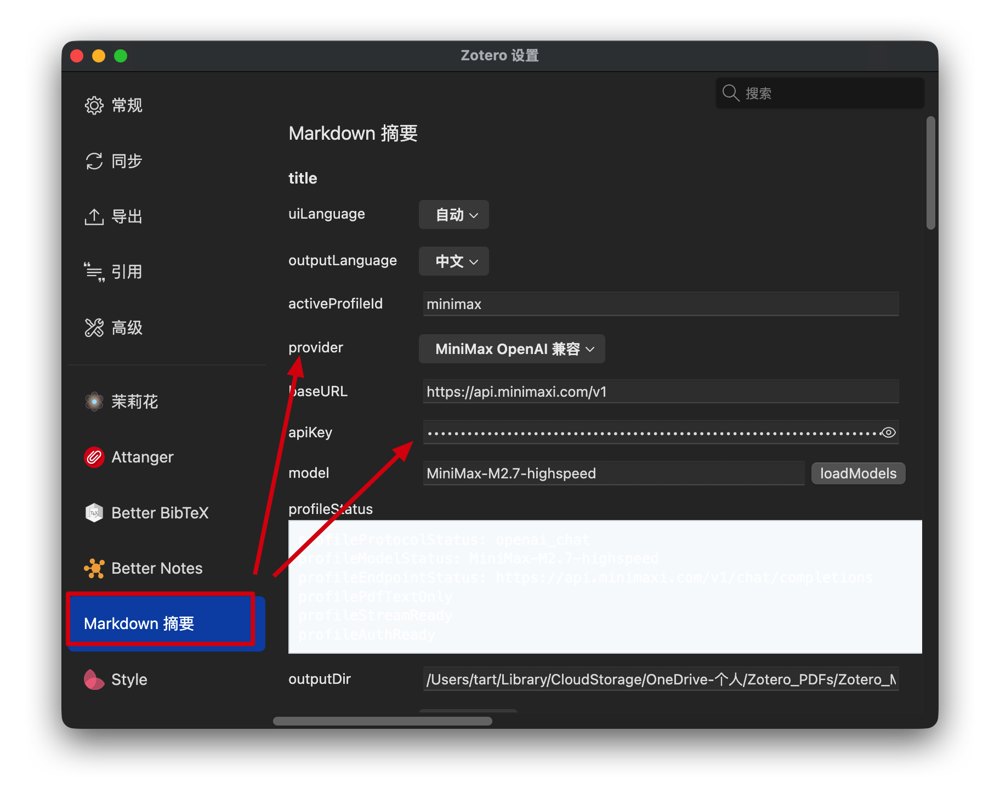

# literature-review-with-LLM

Zotero 文献阅读、论文问答和 Markdown 摘要插件。它把 Zotero 中选中的论文变成一个 Markdown 优先的阅读工作流：生成或更新论文摘要、在论文聊天工作台里继续追问、复制 Markdown 回答、保存会话，并可选地通过本地桥接调用 Gemini / Claude / opencode 命令行工具做交叉建议。

[English README](README.md)

> 当前状态：已经可以用于单篇论文阅读、摘要、图片提问、可选本地 OCR 图片元数据、图表/截图结构化解析、可复核图表数据草稿、模型估计的像素/坐标数据草稿、工作台内图表复核状态编辑、单篇论文阅读日志导出、带领域化写作结构、学科写作示例、证据要求和清单的开题/课题申报笔记导出、带领域化写作结构、投稿类型写作结构、学科写作示例、证据要求和清单的期刊/报告写作提纲导出、正式综述草稿导出、多篇论文对比与 Markdown 文献矩阵报告、证据覆盖图、综合主张台账、两两对比、缺口台账、带主张支持分/主张风险/证据轨迹的集合级综合主张、带就绪度看板的综合路线图、正式报告写作就绪门禁、章节就绪矩阵、联网检索证据包和最终分类级综述 Markdown 的集合级主题聚类工作区、带图式聚类图谱、综合布局板、聚类证据卡、主题归并复核板、主题桥接板、带缺口优先级分和排序线索的重复缺口看板、优先级看板和带下钻明细的图表复核分诊的跨集合综合索引/地图，以及可配置的受控引用网络扩展，但仍处于早期版本。更强的跨文献分析仍在继续完善。



## 核心特色

- **在 Zotero 内直接读论文和追问**：选中一篇论文后打开工作台，问题、回答和当前条目绑定，不需要在多个窗口之间来回复制。
- **Markdown 原生工作流**：生成本地 Markdown 摘要文件，自动链接回 Zotero；回答可复制为原始 Markdown，也可以导出带证据标签的论文阅读日志、带提示模板包写作结构、学科写作示例、投稿类型写作结构、证据要求和清单的开题/课题申报笔记和期刊/报告写作提纲、正式综述草稿，或预览后写回摘要文件。
- **多模型厂商配置**：同一个设置页中配置 MiniMax、DeepSeek、OpenAI-compatible Chat、OpenAI-compatible Responses、Anthropic / Anthropic-compatible、Gemini OpenAI-compatible、Azure OpenAI、Vercel AI Gateway、Cline API、Cloudflare AI、GitHub Models、Hugging Face、DeepInfra、Fireworks AI、Cerebras、NVIDIA NIM、SambaNova、OpenRouter、DashScope、SiliconFlow、Ollama、LM Studio 等档案，并显示内置配置指南和 live-check 命令模板。
- **模型接口诊断**：对 OpenAI-compatible、OpenAI Responses、Anthropic 和常见代理包装响应统一解析文本、流式错误、模型列表和 token usage 元数据，并保存到会话记录；工作台可导出隐藏密钥明文的模型厂商诊断 Markdown，用来排查 endpoint、认证、模型列表、live-check，以及文本/图片/PDF 请求体形态。
- **多篇论文对比与文献矩阵**：多选 Zotero 条目打开工作台时，会把第一篇作为焦点论文，其余论文作为对比上下文；工作台可导出带证据标签的 Markdown 文献矩阵，包含对比表、证据覆盖图、综合主张台账、两两对比和缺口台账，内置 `文献矩阵` 技能可继续调用大模型深化分析。
- **集合级综述工作区**：对 collection 批量生成时，会写出 `papers.json`、论文笔记索引、方法矩阵、研究空白矩阵、启发式主题聚类、带主张支持分、主张风险和证据轨迹的综合主张矩阵、综合冲突与缺口台账、带就绪度看板的综合路线图、研究问题卡、研究想法列表、图表复核批量索引、手动综述草稿、带主张证据审计、路线图就绪度看板、正式报告写作就绪门禁和章节就绪矩阵的正式综述报告草稿、联网检索证据包 `literature-search-evidence.*.md`、外部候选文献 JSON，以及最终 `collection-literature-review.*.md`；同时维护全局 `collections/index.json` 和带图式聚类图谱、综合布局板、带排序分的聚类证据卡、主题归并复核板、主题桥接板、带缺口优先级分和排序线索的重复缺口看板、优先级看板和图表复核下钻卡片的跨集合综合地图。
- **图片提问与图表解析**：工作台支持粘贴截图、拖入图片或选择本地图片；可选本地 OCR 会先通过本机 bridge 记录识别文本，并可在工作台里复核校正；内置 `图表/截图解析` 技能可把论文图片、表格和实验结果整理成带视觉 OCR 文本、表格/数据重建、密集点位数据草稿、多面板、轴段和断轴视觉线索布局诊断、密集点置信度检查、证据映射、复核清单、像素/坐标数据草稿，并可用线性、对数、分段坐标轴校准锚点和断轴区间行补全像素点的轴值，生成可在工作台内编辑且重新导出时会保留人工填写状态的图表人工复核任务队列、collection 级图表复核批量索引、带来源报告下钻的跨集合图表复核分诊，以及可复用 Markdown + JSON/CSV 导出文件的结构化结果。
- **插件完全开源免费**：插件本身不收费；如果使用远程大模型服务，需要自行准备对应厂商的 API key。
- **本地 agent 咨询**：可选连接本机 Gemini、Claude、opencode 命令行工具，让多个本地工具分别给出阅读建议。
- **面向论文阅读的技能模板**：内置深度摘要、方法抽取、实验表格、图表/截图解析、文献矩阵、跨论文综述、分类文献综述、引用核查、候选论文发现等提示模板。
- **候选论文审阅队列**：arXiv / Crossref / Semantic Scholar / Unpaywall 的结果会去重、按可解释优先级排序，也可基于 Semantic Scholar references/citations 做可配置的受控扩展，支持保存人工审阅备注、结构化全文筛选阶段、排除理由、审阅状态看板、应用高置信建议、导出带来源证据摘录、命中上下文、匹配到的 Zotero 批注页标签、来自 Zotero 页文本或本地 `pdftotext` bridge 的 PDF 页级文本定位、扫描版 PDF 的受控 OCR fallback、PDF 抽取质量行与 OCR/稀疏文本/空页/不可访问字节/bridge 请求失败告警、短哈希、降低目录噪声优先级的 indexed-text 证据排序，以及来自分页符或独占行页标记的 best-effort indexed page hints 的 Markdown 审阅报告、写入 JSONL，并且只在人工确认后导入 Zotero。
- **研究领域提示模板包**：可选择通用阅读、AI/ML/系统、交通与城市空域、医学与生命科学、社科与政策、综述写作等模板包；工作台问答、直接生成摘要、开题笔记和期刊/报告提纲都会使用当前模板包。

## 安装

从 GitHub Release 下载最新 XPI：

- [最新 release](https://github.com/KaguraTart/literature-review-with-LLM/releases/latest)
- [literature-review-with-llm.xpi](https://github.com/KaguraTart/literature-review-with-LLM/releases/latest/download/literature-review-with-llm.xpi)

在 Zotero 中安装：

1. 打开 Zotero。
2. 进入 `Tools -> Plugins`。
3. 选择 `Install Plugin From File...`。
4. 选择下载好的 `literature-review-with-llm.xpi`。
5. 如果 Zotero 提示重启，请重启 Zotero。

安装后默认开启自动同步更新。Zotero 会从 GitHub Releases 的 `update.json` 读取最新 XPI，并在扩展更新流程中安装新版本。需要关闭时，打开 `Tools -> Literature Review with LLM 设置`，关闭 `自动同步更新`；这个开关只影响本插件的后台更新策略，不修改 Zotero 的全局扩展更新设置。

当前版本主要面向 Zotero 9.x。

## 快速开始

1. 在 Zotero 中选中一条带 PDF 附件的文献条目。
2. 打开 `Tools -> Literature Review with LLM 设置`，配置模型厂商、Base URL、API key 和模型名称。
3. 运行 `Tools -> 生成 Markdown 总结` 或 `Tools -> 打开论文聊天工作台`。
4. 在工作台里继续提问、复制 Markdown 回答，或把选中的回答写回摘要文件。
5. 需要询问图表或截图时，可在工作台输入框粘贴截图、拖入图片，或点击 `+` 选择本地图片；如果只发送图片，工作台会自动使用默认图片解析问题。图片理解依赖所选模型本身的多模态能力；如果本地 bridge 已运行，也可以开启 `Local OCR` 记录本地 OCR 文本。图表/截图解析回答可导出为 Markdown 报告。

生成的 Markdown 文件会保存到设置中的输出目录。可以在 Zotero 设置页点击 `选择文件夹...` 调用系统文件夹选择器，也可以在工作台设置面板中选择和保存同一个输出目录，不需要手动输入 macOS 或 Windows 路径。默认会按条目创建摘要、会话和候选论文文件，并把摘要文件链接回 Zotero。

## 配置大模型厂商和 API key

打开 `Tools -> Literature Review with LLM 设置`：



主要字段：

- `默认接口档案`：当前启用的模型档案。
- `Provider`：选择厂商或协议预设，例如 MiniMax、DeepSeek、OpenAI Compatible Chat、OpenAI Compatible Responses、Anthropic、Anthropic-compatible、Gemini OpenAI-compatible、Azure OpenAI、Vercel AI Gateway Chat、Vercel AI Gateway Responses、Vercel AI Gateway Anthropic、Cline API、LiteLLM Proxy、Cloudflare AI OpenAI Chat、Cloudflare AI Responses、Cloudflare AI Anthropic、GitHub Models、Hugging Face、DeepInfra、Fireworks AI、Cerebras、NVIDIA NIM、SambaNova、OpenRouter、DashScope、SiliconFlow、Ollama、LM Studio、Local Agents 等。切换该预设会同步替换 Base URL、协议、能力声明和推荐模型。API key 按厂商档案隔离：切到另一个厂商不会复用上一个厂商的 key，切回已保存过的厂商时会恢复该厂商自己的 key 和模型。
- `Base URL`：接口根地址，例如 `https://api.minimaxi.com/v1`、`https://api.deepseek.com` 或 `http://127.0.0.1:11434/v1`。
- 如果网关或 Azure 风格接口要求查询参数，`Base URL` 可以保留 `?api-version=preview` 这类参数；插件会先追加 `/chat/completions`、`/responses`、`/messages` 或 `/models`，再保留查询参数。
- `API Key`：对应厂商的 API key。本地模型服务如 Ollama 可能不需要远程 API key。
- `Model`：使用的模型名称，例如 MiniMax、DeepSeek 或本地模型服务中的模型 id。优先从当前厂商的“具体模型”下拉选择；选择接口厂商后会自动显示内置推荐模型。OpenRouter、LiteLLM、Cline API 这类聚合服务会额外显示 `模型厂商` 下拉，可以先选 Anthropic、Google Gemini、OpenAI、DeepSeek、MiniMax 等厂商，再选具体模型。点击 `加载模型列表` 会在已填写 API key 且接口支持在线模型列表时追加厂商返回的在线模型。Azure OpenAI deployment 和私有网关通常仍需要通过 `自定义/私有部署模型` 改成你自己的 deployment/model 名。
- `配置指南`：显示当前档案解析后的协议、请求 endpoint、鉴权方式、模型列表地址、输入能力和可复制的终端 live-check 命令，不显示已保存的完整 API key。
- `保存并测试`：会先保存当前厂商档案，再用最新 API key、Base URL 和模型名发起最小连接测试。
- `输入模式`：选择抽取文本输入，或在厂商支持时使用原始 PDF 输入。
- `流式输出`：厂商支持流式响应时可以开启。
- `提示模板包`：选择当前论文所属研究领域，用于调整模型阅读重点。
- `输出目录`：Markdown 摘要、会话、候选论文和日志的保存目录。可点击 `选择文件夹...` 直接选择文件夹，避免手动输入平台路径。

说明：

- MiniMax 是当前包里的默认预设，但仍建议确认模型名和 API key。
- DeepSeek 可使用 OpenAI-compatible Chat 风格的接口配置，默认推荐 `deepseek-v4-flash`；需要更强推理时可选择 `deepseek-v4-pro`。旧的 `deepseek-chat` / `deepseek-reasoner` 仍保留在下拉框中用于兼容。
- OpenAI Compatible Chat 默认发送 `max_tokens`，检测到 `o` 系列 reasoning 模型时会改用 `max_completion_tokens`，并默认避开很多 reasoning 路由会拒绝的 `temperature` / `n` 字段；自定义路由可在 `bodyExtra.tokenLimitField` 中显式填写 `max_completion_tokens` 或 `max_tokens`，显式填写的 `bodyExtra.temperature` 或 `bodyExtra.n` 仍会生效。
- OpenAI Compatible Chat 的流式请求会默认发送 `stream_options.include_usage`，方便在厂商返回时保存 token usage 元数据；流式解析同时支持 SSE `data:`、raw JSON / JSONL、`choices[].delta` 和 Gemini/常见路由风格的 `candidates[].content.parts[]` 正文片段，并会过滤 reasoning/thinking 片段。
- 如果某些路由或 reasoning 模型拒收默认字段，可在 `bodyExtra.omitFields` 填写要移除的顶层请求字段，例如 `["temperature", "n", "max_tokens"]`，发送前会自动剔除。
- OpenAI-compatible Chat 和 Responses 请求在厂商明确拒收 `stream_options`、JSON mode 格式、token limit 或 `temperature` 等可选字段时，会自动用更窄的请求体重试；常见网关返回的结构化 `param` / `parameters` 错误也会被识别。
- 如果某个厂商或路由提供 `/v1/responses`，选择 `OpenAI Compatible Responses`；这个档案可在模型支持时声明 PDF 原文和图片输入能力。
- Anthropic 官方接口使用 `Anthropic` 档案；第三方 Anthropic 风格路由或代理使用 `Anthropic Compatible Messages`，默认走 Bearer auth。
- Anthropic-compatible 请求在路由明确拒收 `stream`、`metadata`、`thinking`、`top_p`、`top_k`、`stop_sequences`、`tools` 或 `tool_choice` 等可选 body 字段时，也会自动移除后重试。如果路由拒收 `anthropic-version` header，设置页测试、工作台和直接摘要路径都会自动去掉该 header 再试一次；也可以在 `bodyExtra.omitAnthropicVersion` 填 `true` 固定关闭。如果路由明确要求 `authorization`、`x-api-key` 或 `api-key`，重试路径会把同一个已保存 key 切到对应 header，并记住可用的 `bodyExtra.authHeader`。
- Gemini 当前通过 OpenAI-compatible endpoint 风格配置。
- Vercel AI Gateway 内置三种档案：OpenAI Chat 和 Responses 使用 `https://ai-gateway.vercel.sh/v1`；Anthropic Messages 使用 `https://ai-gateway.vercel.sh`。API key 处填写 AI Gateway API key。Chat 档案在所选网关模型支持时可使用图片输入；Responses 和 Anthropic 档案也允许原始 PDF 输入。
- Cline API 使用 `https://api.cline.bot/api/v1` 作为 OpenAI-compatible Chat endpoint。“具体模型”下拉会列出常用的 `provider/model` 路由 ID，例如 Anthropic、Gemini、OpenAI、DeepSeek、xAI、MiniMax 等选项；该预设默认声明支持图片输入，但真实图片理解能力仍取决于被路由到的具体模型。
- Cloudflare AI 预设使用 `https://api.cloudflare.com/client/v4/accounts/YOUR_ACCOUNT_ID/ai/v1`；需要把 `YOUR_ACCOUNT_ID` 替换为你的 Cloudflare account ID，API key 处填写 Cloudflare API token。内置三种档案：OpenAI Chat、OpenAI Responses 和 Anthropic-compatible Messages。模型列表、原始图片和 PDF 输入默认关闭，因为实际支持取决于所选 Workers AI 或路由模型。
- GitHub Models 使用 `https://models.github.ai/inference`，不会自动追加 `/v1`，并内置 GitHub API headers；API key 处填写具备 Models 访问权限的 PAT。
- Hugging Face 使用 `https://router.huggingface.co/v1` 的 OpenAI-compatible Chat Completions 路由；API key 处填写 Hugging Face access token。该预设默认开启图片输入声明，但具体能否理解图片取决于所选模型。
- DeepInfra 使用 `https://api.deepinfra.com/v1/openai` 的 OpenAI-compatible Chat Completions 路由；API key 处填写 DeepInfra API key。该预设默认开启图片输入声明，因为 DeepInfra 的视觉/OCR 模型支持 OpenAI 风格图片内容；具体能否理解图片仍取决于所选模型。
- Fireworks AI、Cerebras、NVIDIA NIM、SambaNova 已作为 OpenAI-compatible 命名预设加入；SambaNova 也提供 Responses 和 Anthropic-compatible 预设。
- Local Agents 走本地 HTTP bridge，不直接调用远程模型 API。同一个 bridge 也提供可选本地 OCR 使用的 `ocr_image` 和本地 PDF 页文本抽取使用的 `extract_pdf_pages`，后者可在文本过少时对扫描页做 OCR fallback。
- API keys 存在本机 Zotero 偏好设置中。不要把 `.env` 文件或本地偏好导出提交到仓库。

### 主流接口 live-check 快速配置

在写入 Zotero 设置前，可以先生成一个本地草稿：

```bash
npm run verify:provider:live -- --env-template --dotenv-template --include core > .env.local
```

填好对应变量后，先做一次不触网的配置预检，确认 API key、模型名和 Base URL 没有漏填：

```bash
npm run verify:provider:live -- --doctor --include core --provider-env-file .env.local
```

预检通过后，按实际接口类型运行：

```bash
# OpenAI 官方 Responses 格式
npm run verify:provider:live -- --include openai --provider-env-file .env.local --fail-on-skip

# 通用 OpenAI-compatible Chat 格式
npm run verify:provider:live -- --include openai-compatible --provider-env-file .env.local --fail-on-skip

# 通用 OpenAI-compatible Responses 格式
npm run verify:provider:live -- --include openai-responses-compatible --provider-env-file .env.local --fail-on-skip

# Anthropic 官方 Messages 格式
npm run verify:provider:live -- --include anthropic --provider-env-file .env.local --fail-on-skip

# 通用 Anthropic-compatible Messages 格式
npm run verify:provider:live -- --include anthropic-compatible --provider-env-file .env.local --fail-on-skip
```

本地 OpenAI-compatible 运行时可用 `--include local` 检查，并填写 `OLLAMA_MODEL` / `OLLAMA_BASE_URL` 或 `LM_STUDIO_MODEL` / `LM_STUDIO_BASE_URL`；除非本地网关要求鉴权，API key 可以留空。

## 论文聊天工作台

工作台是一个紧凑的论文阅读界面：

- 顶栏显示当前论文、模型档案和设置入口。
- 中间区域渲染 Markdown 回答，支持标题、列表、表格、代码块和轻量公式显示。
- 输入框可以继续围绕当前论文提问。
- 输入框支持粘贴截图、拖入图片和选择本地图片；图片会以当前模型协议支持的格式发送。只贴图片直接发送时，会自动请求模型解析图片。开启 `Local OCR` 后，本地 bridge 可把可编辑 OCR 元数据写入会话和图表解析报告。最近一次图表/截图解析回答可从会话与文件面板导出。
- 回答可以复制为 Markdown，也可以预览后写回摘要。
- 会话会按论文保存，同时镜像为 Zotero 条目的 Markdown 链接附件；再次打开同一篇论文时，会优先恢复本地索引记录的最后活跃会话。
- 设置面板可调整模型、咨询模式、论文元信息，导出隐藏密钥明文的模型厂商诊断报告，并管理会话、阅读日志/综述草稿导出和候选论文工具。

常见提问：

- 总结这篇论文的主要贡献。
- 提取方法流程和核心模块。
- 把实验数据整理成 Markdown 表格。
- 找出结论和实验支撑之间是否存在缺口。
- 列出局限、风险和后续实验建议。

## 本地 Agents

插件可以通过本地 bridge 调用 Gemini、Claude 和 opencode 命令行工具，适合让多个本地工具独立给出阅读建议或审稿式反馈。

安装依赖：

```bash
npm install
```

启动或安装本地服务：

```bash
npm run local-agent:service:start
npm run local-agent:service:check
```

常用命令：

```bash
npm run local-agent:service:install
npm run local-agent:service:restart
npm run local-agent:service:doctor
npm run local-agent:service:stop
```

默认本地端点：

```text
http://127.0.0.1:3333/mcp
```

这些命令行工具需要在本机单独安装并完成认证。插件不负责管理各工具的账号登录。

可选本地 OCR 和 PDF 页文本抽取：

- bridge 暴露 `ocr_image` 工具，默认 OCR 命令是 `/opt/homebrew/bin/tesseract`，默认 OCR 语言是 `eng`。
- 启动服务前可用 `LOCAL_AGENT_TESSERACT_BIN=/path/to/tesseract` 覆盖 OCR 命令，用 `LOCAL_AGENT_TESSERACT_LANG=eng+chi_sim` 覆盖服务默认语言；工作台设置面板也可以修改本地 OCR endpoint、工具名和单次请求语言。中文 OCR 需要本机已安装对应 Tesseract 语言包。
- 在工作台设置面板启用 `Local OCR` 后，图片提问会先尝试记录本地 OCR 文本；OCR 失败只会写入本机会话元数据，不会阻断远程模型请求。
- 同一个 bridge 也暴露 `extract_pdf_pages` 工具，用于对本地 PDF 文件或内存中的 PDF 字节做 best-effort 页级文本抽取。默认文本抽取命令是 `/opt/homebrew/bin/pdftotext`，启动服务前可用 `LOCAL_AGENT_PDFTOTEXT_BIN=/path/to/pdftotext` 覆盖；当抽取文本过少且调用方启用 OCR fallback 时，bridge 会用 `/opt/homebrew/bin/pdftoppm` 渲染有限页数，再用 Tesseract OCR。`ocrPageStrategy: "sparse"` 会利用 `pdftotext` 的分页信号优先 OCR 全文中的空页或低文本页，然后把恢复出来的 OCR 页和普通文本页合并。渲染命令可用 `LOCAL_AGENT_PDFTOPPM_BIN=/path/to/pdftoppm` 覆盖。返回 JSON 会包含 `quality` 对象，记录文本长度、可读页数、空页数、是否使用 OCR fallback、逐页 OCR 信号（`textChars`、`ocrConfidence`、空页/错误页告警），以及 `ocr_fallback_used`、`sparse_text` 等告警。

## 开发

安装依赖：

```bash
npm install
```

运行测试：

```bash
npm test
```

构建 XPI：

```bash
npm run build
```

完整检查：

```bash
npm run check
```

完整检查会运行测试、类型检查、provider 文本/流式/图片/PDF mock 校验、provider catalog 校验、写回 smoke 校验、打包校验、readiness 检查和空白字符检查。

可选的真实厂商接口检查需要使用你自己的 API credentials：

```bash
npm run verify:provider:live -- --list
npm run verify:provider:live -- --list --include mainstream
npm run verify:provider:live -- --include core --provider-env-file .env.local --fail-on-skip
npm run verify:provider:live -- --include openai-chat --stream --provider-env-file .env.local
npm run verify:provider:models:live -- --include anthropic-messages --provider-env-file .env.local
OPENAI_API_KEY=... OPENAI_MODEL=... npm run verify:provider:live -- --include openai
OPENAI_API_KEY=... OPENAI_MODEL=... npm run verify:provider:live -- --include openai --stream
OPENAI_API_KEY=... OPENAI_MODEL=... npm run verify:provider:image:live -- --include openai
OPENAI_API_KEY=... OPENAI_MODEL=... npm run verify:provider:pdf:live -- --include openai
ANTHROPIC_API_KEY=... ANTHROPIC_MODEL=... npm run verify:provider:live -- --include anthropic
ANTHROPIC_API_KEY=... ANTHROPIC_MODEL=... npm run verify:provider:live -- --include anthropic --stream
ANTHROPIC_API_KEY=... ANTHROPIC_MODEL=... npm run verify:provider:image:live -- --include anthropic
ANTHROPIC_API_KEY=... ANTHROPIC_MODEL=... npm run verify:provider:pdf:live -- --include anthropic
```

第三方路由或本地接口请设置对应的 `*_BASE_URL`，并使用 `openai-compatible`、`openai-responses-compatible` 或 `anthropic-compatible`。Raw PDF live 检查会跳过 OpenAI-compatible Chat 档案，因为这类档案使用抽取文本输入。

如果你配置的路由支持某项输入能力，但内置默认档案没有打开，可以用每个 case 对应的能力覆盖变量。例如某个 Anthropic-compatible 路由支持 PDF document 输入，可以这样检查：

```bash
ANTHROPIC_COMPATIBLE_CAPABILITIES_JSON='{"pdfBase64":true}' npm run verify:provider:pdf:live -- --include anthropic-compatible
```

如果某个兼容路由支持图片但默认档案没有打开，可使用图片 live 检查并临时开启能力，例如：`ANTHROPIC_COMPATIBLE_CAPABILITIES_JSON='{"imageBase64":true}' npm run verify:provider:image:live -- --include anthropic-compatible`。

临时检查也可以用全局参数：`--capabilities-json '{"pdfBase64":true}'` 或 `--capabilities-json '{"imageBase64":true}'`。

命名厂商的 live 检查使用各自的环境变量：

```bash
MINIMAX_API_KEY=... MINIMAX_MODEL=... npm run verify:provider:live -- --include minimax
GEMINI_API_KEY=... GEMINI_MODEL=... npm run verify:provider:live -- --include gemini
AZURE_OPENAI_API_KEY=... AZURE_OPENAI_MODEL=... AZURE_OPENAI_BASE_URL=... npm run verify:provider:live -- --include azure-openai
VERCEL_AI_API_KEY=... VERCEL_AI_MODEL=... npm run verify:provider:live -- --include vercel-ai-chat
VERCEL_AI_RESPONSES_API_KEY=... VERCEL_AI_RESPONSES_MODEL=... npm run verify:provider:live -- --include vercel-ai-responses
VERCEL_AI_ANTHROPIC_API_KEY=... VERCEL_AI_ANTHROPIC_MODEL=... npm run verify:provider:live -- --include vercel-ai-anthropic
CLINE_API_KEY=... CLINE_MODEL=... npm run verify:provider:live -- --include cline-api
LITELLM_PROXY_BASE_URL=http://localhost:4000 LITELLM_PROXY_API_KEY=... LITELLM_PROXY_MODEL=openai/gpt-4o-mini npm run verify:provider:live -- --include litellm-proxy-chat
LITELLM_PROXY_RESPONSES_BASE_URL=http://localhost:4000 LITELLM_PROXY_RESPONSES_API_KEY=... LITELLM_PROXY_RESPONSES_MODEL=openai/gpt-4o-mini npm run verify:provider:live -- --include litellm-proxy-responses
LITELLM_PROXY_ANTHROPIC_BASE_URL=http://localhost:4000 LITELLM_PROXY_ANTHROPIC_API_KEY=... LITELLM_PROXY_ANTHROPIC_MODEL=anthropic/claude-sonnet-4-6 npm run verify:provider:live -- --include litellm-proxy-anthropic
CLOUDFLARE_API_KEY=... CLOUDFLARE_MODEL=... CLOUDFLARE_BASE_URL=https://api.cloudflare.com/client/v4/accounts/YOUR_ACCOUNT_ID/ai/v1 npm run verify:provider:live -- --include cloudflare-ai-chat
CLOUDFLARE_RESPONSES_API_KEY=... CLOUDFLARE_RESPONSES_MODEL=... CLOUDFLARE_RESPONSES_BASE_URL=https://api.cloudflare.com/client/v4/accounts/YOUR_ACCOUNT_ID/ai/v1 npm run verify:provider:live -- --include cloudflare-ai-responses
CLOUDFLARE_ANTHROPIC_API_KEY=... CLOUDFLARE_ANTHROPIC_MODEL=... CLOUDFLARE_ANTHROPIC_BASE_URL=https://api.cloudflare.com/client/v4/accounts/YOUR_ACCOUNT_ID/ai/v1 npm run verify:provider:live -- --include cloudflare-ai-anthropic
GITHUB_MODELS_API_KEY=... GITHUB_MODELS_MODEL=... npm run verify:provider:live -- --include github-models
HUGGINGFACE_API_KEY=... HUGGINGFACE_MODEL=... npm run verify:provider:live -- --include huggingface
DEEPINFRA_API_KEY=... DEEPINFRA_MODEL=... npm run verify:provider:live -- --include deepinfra
FIREWORKS_API_KEY=... FIREWORKS_MODEL=... npm run verify:provider:live -- --include fireworks
CEREBRAS_API_KEY=... CEREBRAS_MODEL=... npm run verify:provider:live -- --include cerebras
NVIDIA_NIM_API_KEY=... NVIDIA_NIM_MODEL=... npm run verify:provider:live -- --include nvidia-nim
SAMBANOVA_API_KEY=... SAMBANOVA_MODEL=... npm run verify:provider:live -- --include sambanova
SAMBANOVA_RESPONSES_API_KEY=... SAMBANOVA_RESPONSES_MODEL=... npm run verify:provider:live -- --include sambanova-responses
SAMBANOVA_ANTHROPIC_API_KEY=... SAMBANOVA_ANTHROPIC_MODEL=... npm run verify:provider:live -- --include sambanova-anthropic
DEEPSEEK_API_KEY=... DEEPSEEK_MODEL=deepseek-v4-flash npm run verify:provider:live -- --include deepseek
OPENROUTER_API_KEY=... OPENROUTER_MODEL=... npm run verify:provider:live -- --include openrouter
GROQ_API_KEY=... GROQ_MODEL=... npm run verify:provider:live -- --include groq
MISTRAL_API_KEY=... MISTRAL_MODEL=... npm run verify:provider:live -- --include mistral
DASHSCOPE_API_KEY=... DASHSCOPE_MODEL=... npm run verify:provider:live -- --include dashscope
SILICONFLOW_API_KEY=... SILICONFLOW_MODEL=... npm run verify:provider:live -- --include siliconflow
OLLAMA_MODEL=llama3.1 OLLAMA_BASE_URL=http://localhost:11434/v1 npm run verify:provider:live -- --include ollama
LM_STUDIO_MODEL=local-model LM_STUDIO_BASE_URL=http://127.0.0.1:1234/v1 npm run verify:provider:live -- --include lm-studio
```

同样的命名规则也适用于 `XAI_*`、`TOGETHER_*`、`KIMI_*`、`PERPLEXITY_*`、`DEEPSEEK_ANTHROPIC_*`、`ZAI_ANTHROPIC_*`、`ZHIPU_*`、`VOLCENGINE_*`、`QIANFAN_*`、`HUNYUAN_*`、`HUGGINGFACE_*`、`DEEPINFRA_*`、`VERCEL_AI_*`、`VERCEL_AI_RESPONSES_*`、`VERCEL_AI_ANTHROPIC_*`、`CLINE_*`、`CLOUDFLARE_*`、`CLOUDFLARE_RESPONSES_*` 和 `CLOUDFLARE_ANTHROPIC_*`。远程命名厂商只有覆盖内置 endpoint 或使用代理时，才需要额外设置对应的 `*_BASE_URL`。Ollama、LM Studio 这类本地 provider 的 live 检查会显式要求 `*_BASE_URL`，这样在没有环境变量时不会误打到本机端口；API key 默认可选，除非你的本地服务要求鉴权。

运行 `npm run verify:provider:live -- --list --json` 可以直接列出全部 live-check case、协议、profile id 和对应环境变量名。

`--include` 支持填写 case id，也支持填写验证 group。内置 group 包括：`core`（基础 OpenAI / OpenAI-compatible / Anthropic）、`openai-chat`、`openai-responses`、`anthropic-messages`、`mainstream`、`remote`、`local` 和 `all`。`mainstream` 是覆盖设置页当前全部内置 provider case 的宽口径首轮检查组；如果只想跑最小协议族 smoke set，请使用 `core`。如果 group 名和 case id 可能冲突，会优先按 case id 处理，所以 `--include anthropic` 只检查官方 Anthropic；要检查整个 Anthropic Messages 协议族，请使用 `--include anthropic-messages`。
`--include` 同时接受 hyphen 和 underscore 写法，例如 `openai-compatible`、`openai_compatible`、`anthropic-messages`、`anthropic_messages` 会解析到同一组规范 live-check selector。

运行 `npm run verify:provider:live -- --doctor --include core --provider-env-file .env.local` 可以只检查本地配置完整性，不会调用远程接口。输出会列出每个 case 的缺失环境变量、解析后的 endpoint、模型来源、鉴权状态、输入能力和下一步可复制命令；API key 只显示是否已配置，不会打印明文。doctor 模式下即使指定的 env 文件还没创建，也会把它作为 warning 继续诊断，方便先看到必须填写的变量；真正的 live 检查仍要求指定的 env 文件存在。

运行 `npm run verify:provider:live -- --env-template --include openai-compatible` 可以打印选中 live-check case 的可复制环境变量模板，并带上默认模型和 endpoint 提示；加 `--dotenv-template` 可以生成普通 `.env.local` 草稿，例如 `npm run verify:provider:live -- --env-template --dotenv-template --include core > .env.local`。草稿会让 API key 保持空白、标出内置默认值，并提示哪些占位 endpoint 必须先替换再运行。如果要写进 CI secrets 或本地 shell 脚本，可以再加 `--json` 输出结构化模板。Zotero 设置页指南和导出的厂商诊断报告也会显示同一条模板命令。

live 检查也可以读取不提交到仓库的本地 env 文件：

```bash
npm run verify:provider:live -- --include openai-compatible --provider-env-file .env.local
```

`--provider-env-file` 读取 `KEY=value` 行，也支持可选的 `export KEY=value`；它只补充缺失或空值，当前 shell 里已经存在的环境变量优先。`--env-file` 仍作为兼容别名保留，但建议使用较长的参数名，避免和较新 Node.js CLI 选项冲突。

live 检查也支持请求头和请求体覆盖。自定义网关可使用重复的 `--header name=value`，或使用更细的环境变量，例如 `OPENAI_COMPATIBLE_HEADERS_JSON`、`OPENAI_RESPONSES_COMPATIBLE_HEADERS_JSON`、`ANTHROPIC_COMPATIBLE_HEADERS_JSON`。`--body-extra-json` 会作用于本次选择的所有 case；也可以使用 `OPENAI_COMPATIBLE_BODY_EXTRA_JSON`、`OPENAI_RESPONSES_COMPATIBLE_BODY_EXTRA_JSON`、`ANTHROPIC_COMPATIBLE_BODY_EXTRA_JSON`、`OPENAI_BODY_EXTRA_JSON`、`ANTHROPIC_BODY_EXTRA_JSON`。

```bash
OPENAI_COMPATIBLE_API_KEY=... \
OPENAI_COMPATIBLE_MODEL=... \
OPENAI_COMPATIBLE_BASE_URL=... \
OPENAI_COMPATIBLE_HEADERS_JSON='{"HTTP-Referer":"https://example.org","X-Title":"Literature Review with LLM"}' \
OPENAI_COMPATIBLE_BODY_EXTRA_JSON='{"omitFields":["temperature","n","max_tokens"]}' \
npm run verify:provider:live -- --include openai-compatible
```

构建产物位置：

```text
build/literature-review-with-llm.xpi
```

Zotero 自动更新元数据位置：

```text
build/update.json
```

`addon/manifest.json` 会把 Zotero 指向稳定的 GitHub Releases `update.json` 地址。`update.json` 会记录当前版本的 XPI 下载地址、XPI `sha256` 校验值和 Zotero 兼容版本范围。发布时上传 `literature-review-with-llm.xpi` 和 `update.json` 两个产物，仓库本身不提交构建产物。推送 `v*` tag 后，Release workflow 会运行完整门禁、重新构建 XPI、按该 tag 重新生成 `update.json`，并把两个文件上传到 GitHub Release，这样 Zotero 可以从稳定更新地址发现最新包。

插件默认开启自动同步更新。用户可以在 Zotero 的 `Literature Review with LLM` 设置页关闭 `自动同步更新`；关闭后插件会停止主动更新提示，并尽量把当前扩展的后台更新策略切换为禁用。Zotero 的全局扩展更新策略仍由 Zotero 自身管理。

## 当前局限

- 多篇论文对比目前限制在工作台上下文内，默认最多纳入 5 篇对比论文，并已支持导出包含证据覆盖、综合主张台账、两两对比和缺口台账的 Markdown 文献矩阵；collection 批量生成已加入启发式主题聚类、带主张支持分/主张风险/证据轨迹的综合主张矩阵、综合冲突与缺口台账、带就绪分、阻塞问题和下一步动作的综合路线图、带主张证据审计、路线图就绪度看板、正式报告写作就绪门禁和章节就绪矩阵的正式综述报告草稿，以及带图式聚类图谱、综合布局板、聚类证据卡排序分、聚类评分、排序线索、连接证据、复核风险标注、聚类阈值校准板、主题归并复核板、主题桥接板、带缺口优先级分和排序线索的重复缺口看板、优先级看板和图表复核下钻明细的跨集合综合地图，但聚类、布局分区、主张支持分、路线图就绪分、正式报告就绪分、章节就绪分、阈值建议、缺口优先级权重和排序权重仍是确定性规则，报告在正式写作前仍需要人工复核。
- 已支持单轮图片附件提问和 `图表/截图解析` 技能，并加入可复核校正的本地 OCR 元数据、结构化视觉 OCR / 表格重建输出契约、最近一次图表解析回答的 Markdown 导出报告、从重建 Markdown 表格解析出的 JSON/CSV sidecar、从表格/OCR/文本抽取的低置信图表数据草稿、从专门图表表格识别出的密集点位数据草稿、从模型回答中抽取的像素/坐标数据草稿、显式坐标轴校准锚点导出、有足够锚点时对像素点做线性/对数/分段轴值补全、断轴区间行校准、带段间像素/数值间隙的可复核断轴校准映射、多面板 panel 覆盖诊断、自动 panel 分割候选框、axis segment 布局诊断、断轴视觉线索检测和复核任务、密集点置信度检查、针对坐标轴校准/校准锚点质量/断轴分段覆盖/置信度/证据标签/点位覆盖的自动质量审阅，以及图表批量复核看板、collection 级跨报告图表复核索引、带可展开下钻卡片和机器可读批量状态回写目标的跨集合图表复核分诊、带默认 `todo` 状态的图表复核任务队列、复核人/期限/备注工作台编辑、完成条件和重新导出状态保留能力；图表、表格和手写笔记的理解质量仍取决于模型能力和本地 OCR 语言包，密集点位、panel 分割框、断轴视觉线索、断轴校准映射、像素坐标、校准锚点和补全轴值都是可复核草稿，不是精确自动数字化结果。
- 公式渲染仍是轻量支持，不是完整 TeX 引擎。
- 论文阅读日志和正式综述草稿目前是带证据摘录、正式报告写作就绪门禁、章节就绪矩阵和人工填写字段的结构化 Markdown 草稿。开题/课题申报笔记和期刊/报告提纲已加入按提示模板包生成的学科写作示例，期刊/报告提纲也已加入期刊研究论文、会议论文、综述论文、技术报告和政策/管理简报的投稿类型写作结构，但仍需要人工编辑后才能作为完整长篇综述或投稿稿件使用。
- 候选论文发现已加入可解释排序、重复项协调、可配置的受控引用网络扩展、人工审阅备注、结构化全文筛选阶段、排除理由、高置信建议应用、审阅状态看板、证据链复核队列、来源证据摘录、已导入且附加 PDF 候选项的 Zotero 全文索引证据摘录（含命中上下文、匹配到的批注页标签、来自已有页文本、本地文件路径或内存 PDF 字节的 PDF 页级文本定位、扫描版 PDF 的稀疏页 OCR fallback、结构化抽取质量诊断、逐页 OCR 置信度信号、校准后的 OCR 置信度摘要和风险标签、PDF 字节不可访问与 bridge 请求失败诊断、indexed-text fallback 定位、重复页眉/页脚清理、目录/参考文献噪声降权、简单断词恢复、分页符或 `Page 12` 这类独占页标记存在时的 best-effort 页提示和短哈希）和 Markdown 候选审阅报告。bridge 页文本抽取仍依赖可访问的 PDF 字节以及本机 Poppler/Tesseract 工具；超出受控 OCR 窗口的整篇扫描件 OCR、无 bridge 原始字节抽取和更强的自动修复仍需要继续加强。
- 工作台 UI 仍在打磨，部分控件和设置项后续会继续简化。
- 原始 PDF 输入依赖厂商能力，很多厂商仍主要使用 Zotero 抽取文本。
- 本地 agent 调用依赖本机 CLI 工具及其认证状态。
- 真实厂商接口验证需要用户自己的 API key，默认检查不会运行 live 验证。
- 目前主要覆盖 Zotero 9.x。

## TODO

- 在当前启发式聚类评分、综合布局分区、主张支持分/风险标签/证据轨迹、路线图就绪分/动作建议、正式报告写作就绪门禁、章节就绪矩阵、证据卡排序分、缺口优先级分、连接证据、复核风险标注和阈值校准板基础上，继续校准综合路线图和最终报告生成。
- 在当前可复核校正的本地 OCR、提示词级视觉 OCR 契约、JSON/CSV 表格 sidecar 导出、可复核图表数据草稿、密集点位数据草稿解析、模型估计像素/坐标草稿、坐标轴校准锚点导出、线性/对数/分段轴值补全、断轴区间行校准、可复核断轴校准映射、多面板布局诊断、自动 panel 分割候选框、axis segment 覆盖诊断、断轴视觉线索复核任务、密集点置信度检查、自动质量审阅、图表批量复核看板、collection 级跨报告图表复核索引、跨集合图表复核分诊、下钻卡片、批量状态回写目标、可跨重新导出保留状态的图表复核任务队列和工作台内复核状态编辑基础上，继续增强可验证的自动 panel 分割、更高置信度的断轴区段校准和密集图表抽取。
- 在当前 Zotero 页文本、本地路径/base64 bridge、带稀疏页选择的受控 OCR fallback、候选报告抽取质量行、结构化抽取质量诊断、逐页 OCR 置信度信号、OCR 风险摘要、PDF 字节不可访问/bridge 请求失败诊断和 indexed-text fallback 后续动作基础上，继续增强超出受控 OCR 窗口的整篇扫描件 OCR、无 bridge 原始字节抽取和自动修复能力。
- 在内置配置指南之外，继续补充更多厂商配置截图和教程。
- 在当前按提示模板包生成的开题/课题申报笔记和期刊/报告提纲学科写作示例、领域写作结构、投稿类型写作结构、证据要求和清单基础上，继续补充更细的学科写作风格模板。

## 安全和隐私

- 妥善保存 API key，不要提交到仓库。
- 不要提交 `.env` 文件。
- 写回摘要前先检查生成内容。
- 替换或覆盖原文档前使用预览步骤。
- 向远程厂商发送未公开论文或敏感笔记前，请确认数据使用边界。

## License

Apache License 2.0. See [LICENSE](LICENSE).

## Author

kaguratart <kaguratart@gmail.com>
