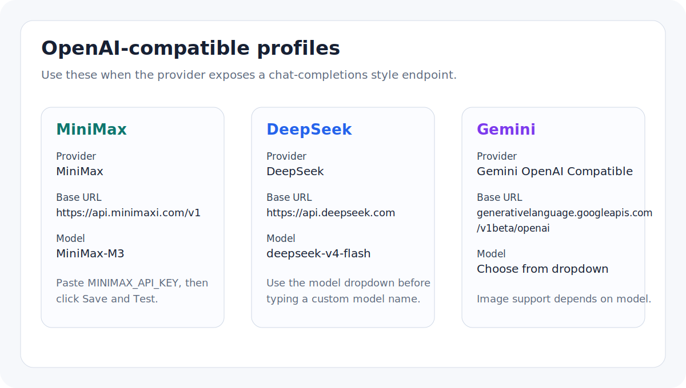
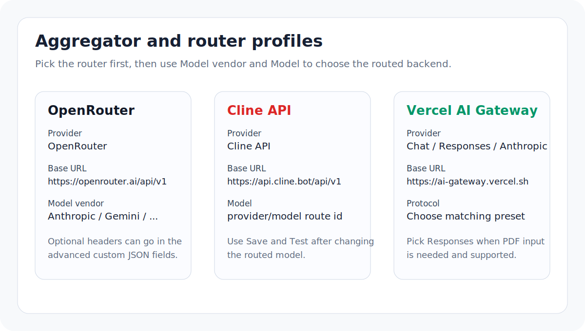
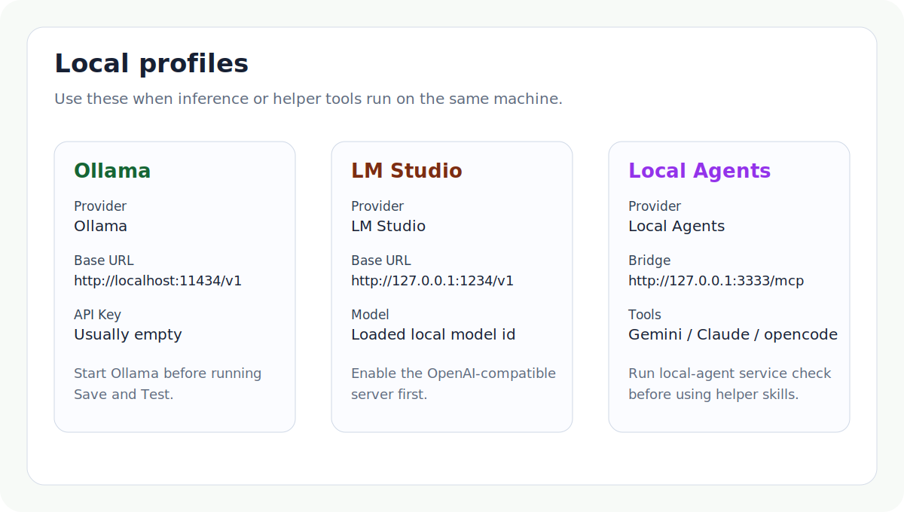

# Provider Setup Examples

This page gives short, provider-specific setup recipes for `Literature Review with LLM`. Use it together with the Zotero settings page:

`Tools -> Literature Review with LLM Settings`

The examples use placeholder API keys. Keep real keys in Zotero preferences or a local `.env.local` file that is not committed.

## Fast Provider Choice

| Need | Recommended profile | Notes |
| --- | --- | --- |
| Low-friction Chinese/English paper reading | `MiniMax` or `DeepSeek` | Use the built-in OpenAI-compatible Chat presets and the model dropdown. |
| Use a Google Gemini endpoint | `Gemini OpenAI Compatible` | Image support depends on the chosen model. |
| Route through multiple model vendors | `OpenRouter`, `Cline API`, or `Vercel AI Gateway` | Choose the router first, then choose `Model vendor` and `Model`. |
| Local inference | `Ollama` or `LM Studio` | Start the local server before `Save and Test`; API key is usually empty. |
| Ask local helper agents | `Local Agents` | Start the local bridge and run the service check first. |

## MiniMax, DeepSeek, Gemini



### MiniMax

1. Select `Provider -> MiniMax`.
2. Keep `Base URL` as `https://api.minimaxi.com/v1` unless you use a proxy.
3. Paste `MINIMAX_API_KEY` into `API Key`.
4. Pick `MiniMax-M3` or another recommended MiniMax model from the model dropdown.
5. Click `Save and Test`.

Local live check:

```bash
MINIMAX_API_KEY= \
MINIMAX_MODEL=MiniMax-M3 \
npm run verify:provider:live -- --include minimax --fail-on-skip
```

### DeepSeek

1. Select `Provider -> DeepSeek`.
2. Keep `Base URL` as `https://api.deepseek.com` unless you use a proxy.
3. Paste `DEEPSEEK_API_KEY` into `API Key`.
4. Pick `deepseek-v4-flash` for fast reading or another DeepSeek model from the dropdown.
5. Click `Save and Test`.

Local live check:

```bash
DEEPSEEK_API_KEY= \
DEEPSEEK_MODEL=deepseek-v4-flash \
npm run verify:provider:live -- --include deepseek --fail-on-skip
```

### Gemini OpenAI-compatible

1. Select `Provider -> Gemini OpenAI Compatible`.
2. Keep the default Gemini OpenAI-compatible Base URL unless your organization uses a gateway.
3. Paste `GEMINI_API_KEY` into `API Key`.
4. Pick a Gemini model from the model dropdown.
5. Click `Save and Test`.

Local live check:

```bash
GEMINI_API_KEY= \
GEMINI_MODEL= \
npm run verify:provider:live -- --include gemini --fail-on-skip
```

## Aggregators And Routers



### OpenRouter

1. Select `Provider -> OpenRouter`.
2. Keep `Base URL` as `https://openrouter.ai/api/v1`.
3. Paste `OPENROUTER_API_KEY` into `API Key`.
4. Use `Model vendor` to narrow the list, then select a routed model.
5. Click `Save and Test`.

If your OpenRouter account requires request attribution headers, add them in advanced `Custom headers JSON`, for example:

```json
{
  "HTTP-Referer": "https://example.org",
  "X-Title": "Literature Review with LLM"
}
```

### Cline API

1. Select `Provider -> Cline API`.
2. Keep `Base URL` as `https://api.cline.bot/api/v1`.
3. Paste `CLINE_API_KEY` into `API Key`.
4. Pick a `provider/model` route from the model dropdown.
5. Click `Save and Test` after every route change.

### Vercel AI Gateway

Use the preset that matches the protocol you want:

- `Vercel AI Gateway Chat`: general OpenAI-compatible Chat routing.
- `Vercel AI Gateway Responses`: use this when the routed model supports Responses-style image or PDF input.
- `Vercel AI Gateway Anthropic`: use this for Anthropic Messages-style routed models.

Paste the AI Gateway key into `API Key`, then choose the routed model from the dropdown.

## Local Profiles



### Ollama

1. Start Ollama and make sure the model is pulled locally.
2. Select `Provider -> Ollama`.
3. Keep `Base URL` as `http://localhost:11434/v1`.
4. Leave `API Key` empty unless your local proxy requires one.
5. Enter or choose the local model id, then click `Save and Test`.

Local live check:

```bash
OLLAMA_BASE_URL=http://localhost:11434/v1 \
OLLAMA_MODEL=llama3.2 \
npm run verify:provider:live -- --include ollama --fail-on-skip
```

### LM Studio

1. Start the LM Studio OpenAI-compatible local server.
2. Select `Provider -> LM Studio`.
3. Keep `Base URL` as `http://127.0.0.1:1234/v1`.
4. Leave `API Key` empty unless your local server requires one.
5. Enter the loaded local model id, then click `Save and Test`.

### Local Agents

Use this profile when you want the workbench to call local Gemini, Claude, or opencode command-line tools through the local bridge.

```bash
npm run local-agent:service:check
```

If the service is not installed or running:

```bash
npm run local-agent:service:install
npm run local-agent:service:start
npm run local-agent:service:check
```

Then select `Provider -> Local Agents` and keep the bridge endpoint as `http://127.0.0.1:3333/mcp`.

## Troubleshooting Checklist

- `401` or `403`: the API key is missing, expired, or not accepted by the selected endpoint.
- `404`: the Base URL may already include or omit the protocol path incorrectly; use the built-in preset first.
- `No text returned from model`: try `Save and Test`, then switch to a recommended model from the dropdown.
- Image question fails: confirm the active profile declares image input and the selected model actually supports images.
- PDF input fails: switch `Input mode` back to extracted text, or use a Responses / Anthropic-style profile that declares PDF support.
- Local profile fails: confirm the local server is listening on the configured port before testing from Zotero.
